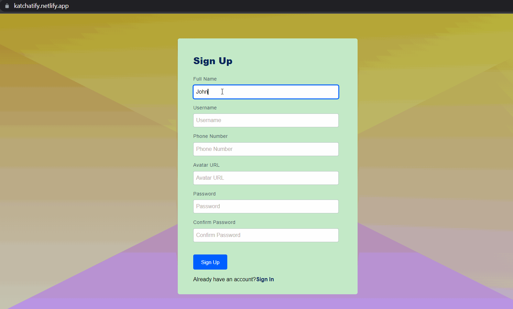
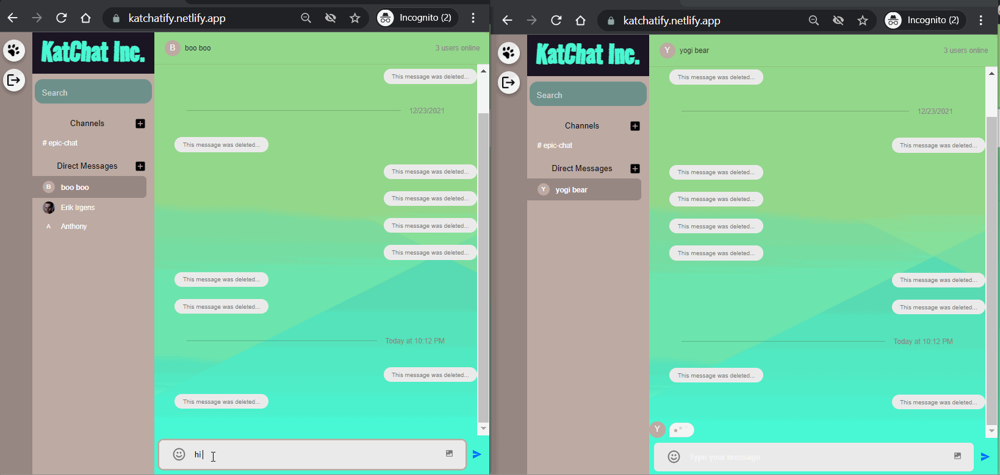
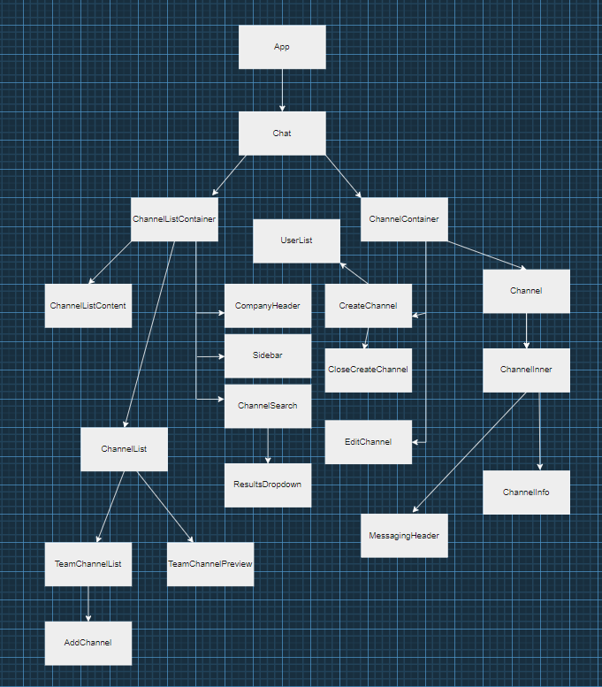

# Real-time Messaging App
<html>
<!-- Project Shields -->
    <p align="left">
        <a href="https://github.com/romankolivashko/chatter">
            
        </a>
	¨
        <a href="https://github.com/romankolivashko/chatter/commits/main">
            
	</a>	
        ¨
        <a href="https://github.com/romankolivashko/chatter/stargazers">
            
        </a>
        ¨
        <a href="https://github.com/romankolivashko/chatter/issues">
           
        </a>
        ¨
        <a href="https://linkedin.com/in/rkolivashko">
            
        </a>
    </p> 
</html>

## Table of Contents
+ [About](#about)
+ [Quick Look](#quick-look)
+ [React Componets Diagram](#diagram)
+ [Decisions made](#decisions)
+ [Prerequisites](#prerequisites)
+ [Resources and Tools](#resources)
+ [Getting Started](#getting_started)
+ [Quick Look](#quick_look)
+ [Stretch Goals](#stretch)
+ [Web-hosted](#hosted)

## About <a name = "about"></a>
The application is built with Node.js and React. Users can authenticate, create custom messaging channels, send direct messges to one another.
Message transport is handled by 3rd party API service - getstream.io, which provides very robust chat feature set.


### Quick look <a name = "quick_look"></a>

## Authentication 


## Core chat features


## React Components Diagram <a name="diagram"></a>


## Decisions made <a name="decisions"></a>
### One of the crucial decisions was to use built-in chat message rendering features. Some of the feature-rich messaging options have been sourced from the API service provider. Features offered by getstream.io:
* Typing indicators: Show when the user is typing
* URL previews: Show an image, text-description or video when adding a URL in a chat message
* User presence: Show who is online
* Reactions & Threads: Support modern messaging best practices such as reactions and threads
* Unread counts: Show the number of unread messages that need attention
* Offline storage: Keep the chat working, even if the network connection is unstable

Additionally, getstream.io service offered generous API call volume limit, while Heroku and Netlify provided free-tier services.

### Prerequisites<a name = "prerequisites"></a>

* Web Browser
* Node.js
* NPM
* Webpack
* Create server/.env file with following entries, all can be obtained from `https://getstream.io/chat/trial/` 
```
STREAM_APP_ID=<your_app_id>
STREAM_API_KEY=<your_api_key>
STREAM_API_SECRET=<your_api_secret>
```

### Resources and tools<a name = "resources"></a>
* https://nodejs.org/en/
* https://reactjs.org/
* https://getstream.io/
* https://app.diagrams.net/
* https://www.svgbackgrounds.com/
* https://www.netlify.com/
* https://heroku.com/

## Getting Started <a name = "getting_started"></a>
Use a command line/Bash to move to the project directory with cd project-directory-here

1. Clone the repository: $ `git clone https://github.com/romankolivashko/chatter.git`
2. Navigate to the chatter/server directory on your computer
3. Run `npm install` in command line/Bash to get all dependencies.
4. Run `npm run dev` in command line/Bash to start up the Node.js server in your browser.
5. Navigate to the chatter/client directory on your computer
6. Run `npm install` in command line/Bash to get all dependencies.
7. Run `npm run start` in command line/Bash to start up the client in your browser.

### Stretch Goald<a name = "stretch"></a>
* Give users an option to reset passwords
* Improve CSS styling
* Currently not responsive, with that either React Native or Flutter seem to be a viable option
* Enable users receive SMS notifications when not online

### Hosted online <a name = "hosted"></a>
[Link](https://katchatify.netlify.app/)

## Known Bugs

[Issues](https://github.com/romankolivashko/chatter/issues)

## License
MIT

## Contact Information
rkolivashko@gmail.com